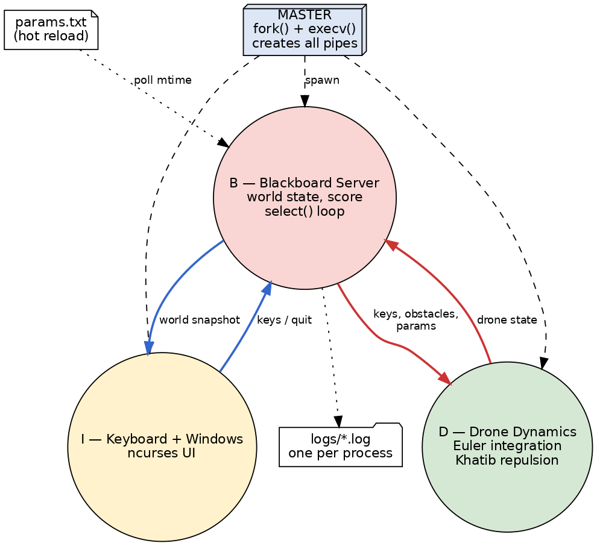
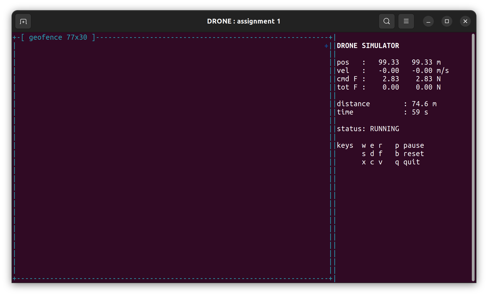

# Assignment 1 - Blackboard Server, Drone, Keyboard (B, D, I)
**Author:** Richard Albert King Mechoda  
**Student:** 8525970  

First deliverable of the drone simulator: the blackboard server, the drone
dynamics and the keyboard manager with the ncurses window, plus the
parameter file. The blackboard is implemented with the **process / pipes /
select** model.

## 1. Sketch of the Architecture



The master creates the four pipes and spawns the three processes with
`fork()` + `execv()`, passing the pipe file descriptors on the command
line. Everything goes through the blackboard:

```
I (keyboard, ncurses)  --- keys, quit --->  B  <--- drone state ---  D (dynamics)
                       <--- world ------   B  --- keys, params --->
```

## 2. Active Components Definition

### A. Master (`src/master.c`)
* **Role:** orchestrator.
* **Function:** creates the pipes, forks B, D, I, closes in every child the
  descriptors it does not need (otherwise the end-of-file would never
  arrive), waits for the window to exit and then terminates the others.
* **Primitives:** `pipe()`, `fork()`, `execv()`, `waitpid()`, `kill()`.

### B. Blackboard Server (`src/blackboard.c`)
* **Role:** central repository of the state of the world.
* **Function:** one `select()` loop over the input pipes; forwards the keys
  to D; receives the drone state from D and sends the world snapshot to I;
  checks the modification time of `params.txt` once per second and applies
  the new values while the system runs.
* **Primitives:** `select()`, `read()`, `write()`, `stat()`.

### C. Drone Dynamics (`src/drone.c`)
* **Role:** physics engine.
* **Function:** at every period T sums the command force and the repulsion
  of the four borders, integrates with the Euler method and sends the new
  state to B.
* **Algorithms:** Euler integration; Latombe/Khatib repulsion for the
  geo-fence walls, F = eta (1/d - 1/rho) / d^2 for d < rho; the repulsion
  is applied as a virtual key pressure (projection on the 8 command
  directions, keeping the strongest), as the assignment sheet suggests.

### D. Keyboard Manager + Window (`src/input.c`)
* **Role:** user interface.
* **Function:** ncurses playfield plus the small lateral inspection window
  (position, velocity, command and total force, distance, time, status);
  the keys are read with a 50 ms timeout so the loop never blocks.
* **Primitives:** `ncurses`, `select()`.

The messages on the pipes are fixed-size structures smaller than
`PIPE_BUF`, so every write is atomic and the messages can never arrive
interleaved.

## 3. Dynamics

For each axis, from `sum F = M x'' + K x'`, Euler's method with interval T gives:

$$x_i = \frac{F T^2 + M (2x_{i-1} - x_{i-2}) + K T x_{i-1}}{M + K T}$$

With a constant force the drone settles at the terminal velocity F/K.
Pushing against a wall, the repulsion balances the command force and the
drone hovers near the border without leaving the area:



## 4. Files

```
assignment1/
|-- Makefile
|-- params.txt        parameters, editable while the simulator runs
|-- README.md
|-- assets/           diagram + screenshot
`-- src/
    |-- master.c      spawner / supervisor
    |-- blackboard.c  B, select loop
    |-- drone.c       D, Euler + repulsion
    |-- input.c       I, ncurses window + keyboard
    |-- common.h      shared definitions
    `-- common.c      helpers (params, pipe I/O, logging)
```

## 5. Installation and Running

```
sudo apt-get install build-essential libncurses-dev
make
./bin/master
```

## 6. Operational Instructions

```
w / e / r : Up-Left    / Up     / Up-Right
s / d / f : Left       / BRAKE  / Right
x / c / v : Down-Left  / Down   / Down-Right
p suspend/resume    b reset    q quit
```
The arrow keys work as well.

The parameters (M, K, T, force step, rho, eta) are in `params.txt` and are
re-read while the simulator runs. Each process writes its own log in
`logs/`.
