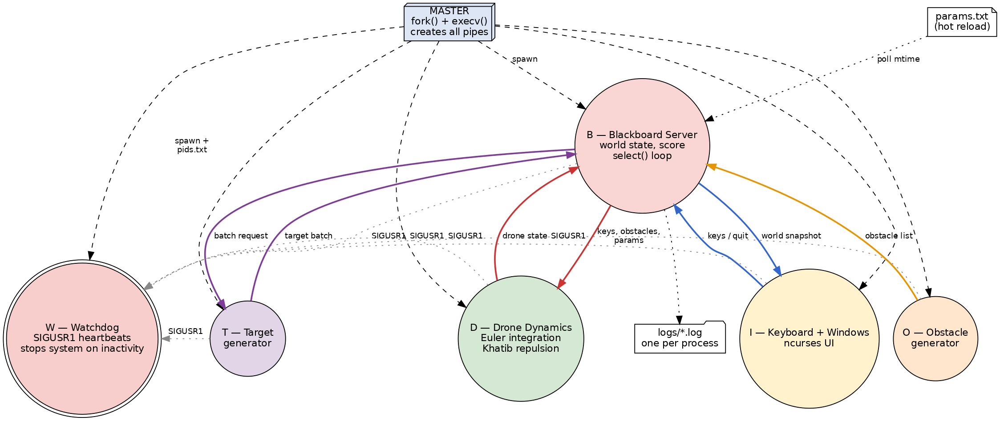
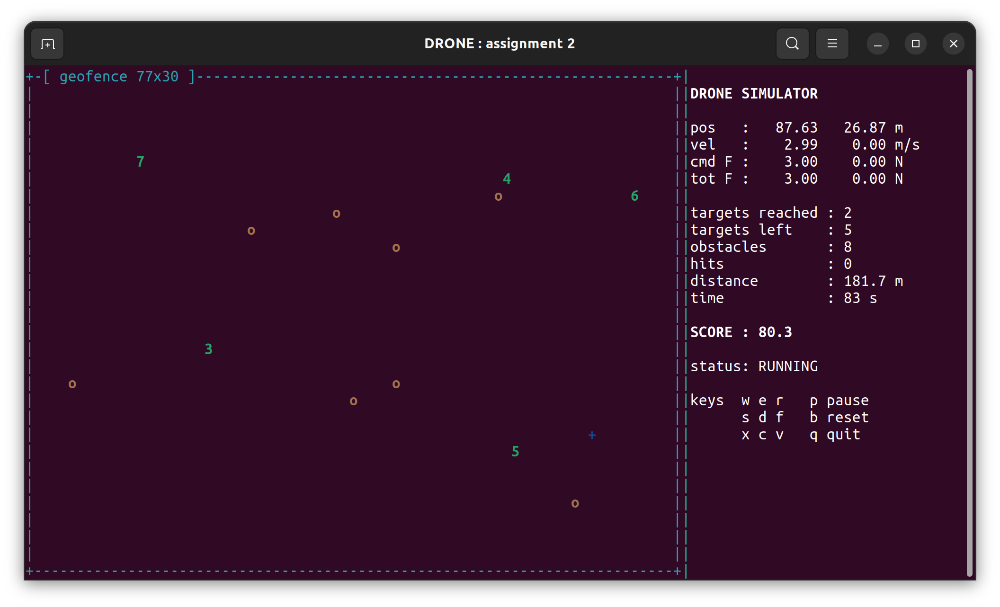
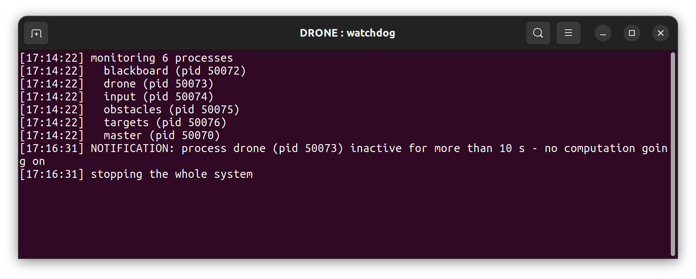

# Assignment 2 - Full System (B, D, I, O, T, W + logfiles)
**Author:** Richard Albert King Mechoda  
**Student:** 8525970  

Second deliverable: the complete drone simulator with six active
components, the parameter file and one logfile per process.

## 1. Sketch of the Architecture



The blackboard server B manages the state of the world (drone, targets,
obstacles, score). The generators O and T build the environment, D moves
the drone, I is the user interface and W supervises everything through
signals. Solid arrows are unnamed pipes (read by B in one `select()`
loop), dotted arrows are SIGUSR1 heartbeats.

**Data flow:**
1. `I` captures the keys and sends them to `B`, which forwards them to `D` as force steps.
2. `O` and `T` generate obstacle and target coordinates and send them to `B`.
3. `D` integrates the dynamics at a fixed rate and sends the drone state to `B`.
4. `B` detects the reached targets and the collisions, computes the score and sends the world snapshot to `I`, which draws it.
5. Every process sends a SIGUSR1 heartbeat to `W` at each cycle of its main loop.

## 2. Active Components Definition

### A. Master (`src/master.c`)
* **Role:** bootstrapper and supervisor.
* **Function:** creates the 7 pipes, forks the watchdog first (so its pid
  can be passed to everybody), then B, D, I, O, T; writes the pid registry
  `logs/pids.txt`; terminates everything when the window exits.
* **Primitives:** `pipe()`, `fork()`, `execv()`, `waitpid()`, `kill()`,
  `sigprocmask()`.

### B. Blackboard Server (`src/blackboard.c`)
* **Role:** central hub.
* **Function:** routes all the traffic with one `select()` loop; the
  targets must be reached **in order**, so only the lowest number is
  checked against the drone position; counts the collisions; accumulates
  distance and time; computes the score; re-reads `params.txt` when it
  changes on disk.
* **Score:** `100*targets - 1.0*time[s] - 0.2*distance[m] - 25*hits`.

### C. Drone Dynamics (`src/drone.c`)
* **Role:** physics engine.
* **Algorithms:** Euler integration (see assignment 1); Latombe/Khatib
  repulsion from every obstacle and from the four borders:
  F = eta (1/d - 1/rho) / d^2 for d < rho, saturated near d = 0. The
  total repulsion is applied as a virtual key pressure (projection on
  the 8 command directions, keeping the strongest), as the sheet
  suggests.

### D. Keyboard Manager + Windows (`src/input.c`)
* **Role:** input handler and renderer (ncurses).
* **Function:** playfield plus lateral inspection window (position,
  velocity, forces, targets, obstacles, hits, distance, time, score,
  status); non-blocking keyboard with a 50 ms timeout.

### E. Obstacles (`src/obstacles.c`)
* **Role:** environment generator.
* **Function:** keeps `n_obstacles` alive; every obstacle has a random
  position and a random lifetime between 10 and 40 s, so they appear and
  disappear during the mission; never spawns near the drone start point.

### F. Targets (`src/targets.c`)
* **Role:** environment generator.
* **Function:** sends a numbered batch of targets; when the blackboard
  reports that all of them are reached, it generates a new batch on
  request.

### G. Watchdog (`src/watchdog.c`)
* **Role:** system monitor, **signal based**.
* **Function:** receives the SIGUSR1 heartbeats; the handler is installed
  with `sigaction(SA_SIGINFO)`, so `si_pid` identifies the sender. If a
  process stays silent more than `wd_timeout` seconds, W writes a
  notification in its log and on stderr and then stops the whole system
  (SIGTERM to every pid of `logs/pids.txt`).
* Note: the master blocks SIGUSR1 before forking and the watchdog
  unblocks it only after `sigaction`. Without this an early heartbeat
  could arrive before the handler exists and kill the watchdog, because
  the default action of SIGUSR1 is termination.

## 3. Simulation Demo



Captured in the middle of a mission: 2 targets already reached in order, 5
remaining, 8 obstacles alive. The score history is written by
B in `logs/blackboard.log`.

The watchdog in action (the drone process was frozen with `kill -STOP`):



## 4. Files

```
assignment2/
|-- Makefile
|-- params.txt        all the parameters, editable while running
|-- README.md
|-- assets/           diagram + screenshots
`-- src/
    |-- master.c      spawner / supervisor (pipes, fork/exec, pids.txt)
    |-- blackboard.c  B, select hub, score, parameter reload
    |-- drone.c       D, Euler dynamics + Khatib repulsion
    |-- input.c       I, ncurses UI + keyboard
    |-- obstacles.c   O, random obstacles with lifetime
    |-- targets.c     T, numbered target batches
    |-- watchdog.c    W, SIGUSR1 heartbeat monitor
    |-- common.h      shared definitions
    `-- common.c      helpers (params, pipe I/O, logging)
```

## 5. Installation and Running

```
sudo apt-get install build-essential libncurses-dev
make
./bin/master
```

## 6. Operational Instructions

```
w / e / r : Up-Left    / Up     / Up-Right
s / d / f : Left       / BRAKE  / Right
x / c / v : Down-Left  / Down   / Down-Right
p suspend/resume    b reset    q quit
```
The arrow keys work as well.

* Legend: blue `+` drone, green `1..9` targets (reach them in order),
  yellow `o` obstacles.
* Try editing `params.txt` while flying (for example `viscosity` or
  `eta`): the new values are applied immediately.
* Watchdog test: `kill -STOP $(pgrep -x drone)`, wait `wd_timeout`
  seconds, the system stops and the notification is in
  `logs/watchdog.log`.
