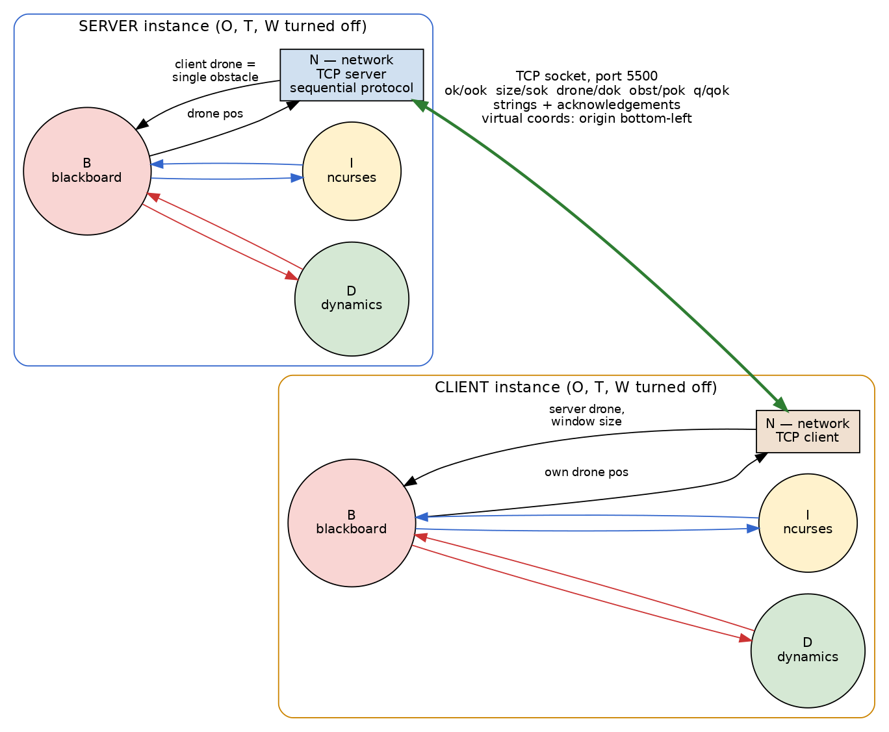
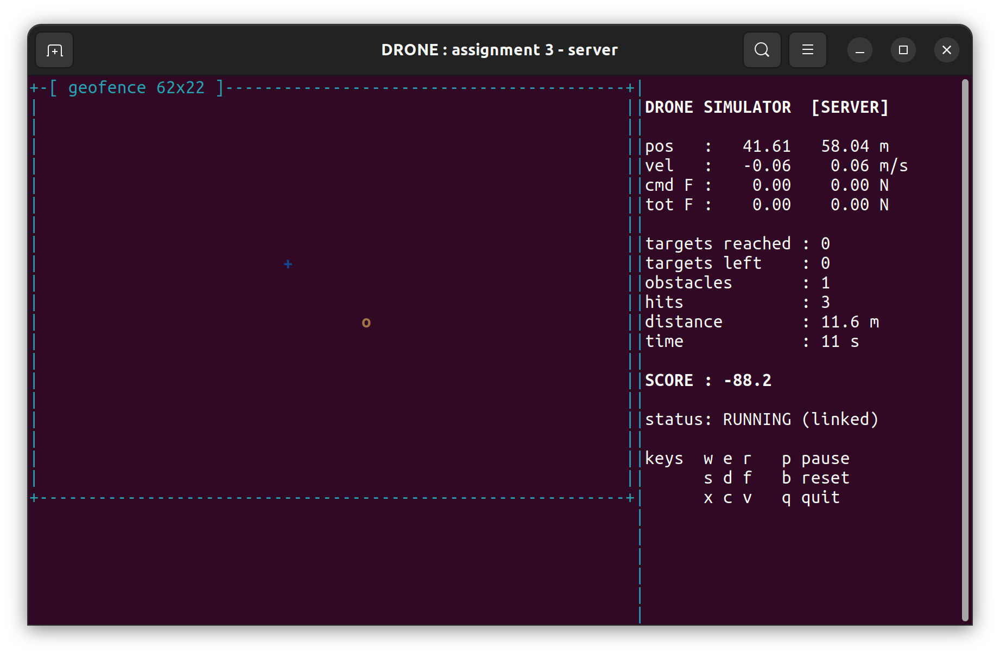
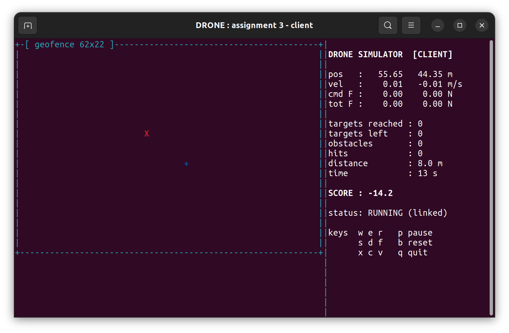

# Assignment 3 - Networked Simulators (standalone / server / client)
**Author:** Richard Albert King Mechoda  
**Student:** 8525970  

**Testing declaration:** the application was tested in **both modalities**  
(server and client, each instance can take both roles) by connecting two
independent instances peer to peer over the local network.
**Companion group:** none, solo submission: I enrolled in the MSc in  
January 2026, after the groups were formed, and this has been communicated
to the professor. The implementation follows the published protocol
exactly (strings, one acknowledgement per message, virtual coordinate
system), so it can be tested against the implementation of any other
group in the same peer to peer conditions.

## 1. Sketch of the Architecture



Two assignment-2 applications connect through a TCP socket. As required,
in networked mode **the obstacle generator, the target generator and the
watchdog are turned off**; a network process N is started instead,
attached to the blackboard with two pipes. The rest (dynamics, keys,
ncurses windows, parameter file, logs) does not change.

* **Server:** communicates the size of its window (the client must
  reproduce it identically), moves its drone as usual, sends its drone
  position, and receives from the client the position of **one obstacle**
  (the client drone), applying the usual law of repulsion. When it
  terminates, it closes the connection.
* **Client:** receives and reproduces the window size, displays the
  server drone (red X), moves its own drone as usual and sends its
  position to the server, which interprets it as an obstacle. When the
  connection closes, it terminates.

## 2. Running Modes

```
./bin/master                  asks: local or networked, then server or client
./bin/master standalone       same as assignment 2 (O, T, W active)
./bin/master server           waits for a client on the port of params.txt
./bin/master client <addr>    connects to the server at <addr>
```

The address and the port (5500, greater than 5000 as required) are in
`params.txt`. On the server machine the LAN address is found with
`ip addr`.

## 3. Protocol (strings + acknowledgement for every message)

```
server:  snd ok;        rcv ook
         snd size l h;  rcv sok
         loop [ quit -> snd q; rcv qok; exit
                snd drone; snd x y;  rcv dok
                snd obst;            rcv x y;  snd pok ]

client:  rcv ok;        snd ook
         rcv size l h;  snd sok
         loop [ rcv x
                x == q     -> snd qok; exit
                x == drone -> rcv x y; snd dok
                x == obst  -> snd x y; rcv pok ]
```

* Every transmission is handshaked (request, datum, acknowledgement) and
  the loops are sequential (deterministic, no select on the socket), as
  the protocol notes allow.
* **Virtual coordinate system:** the coordinates travel with the origin
  in the bottom-left corner of the server window, in window characters
  (the size travels in the `size` message, the rotation alfa is 0). Both
  sides translate to the virtual system before sending and back after
  receiving, so two groups with different internal conventions can
  interoperate.
* The complete conversation can be seen in `logs/network.log` of both
  instances.

## 4. Captured Peer-to-Peer Run

Server instance: its own drone (blue +) and the client drone received
from the socket, treated as the single obstacle (yellow o):



Client instance, same moment: it reproduces the window size communicated
by the server, shows its own drone (blue +) and the server drone (red X):



## 5. Active Components Definition

The six components of assignment 2 (see `assignment2/README.md`), with
the mode logic added in `master.c`, `blackboard.c` and `input.c`, plus:

### N. Network (`src/network.c`)
* **Role:** socket endpoint, both roles implemented.
* **Function (server):** `socket()`, `bind()`, `listen()`, `accept()`,
  handshake, then the sequential protocol loop at about 20 Hz: it sends
  the latest drone position (kept fresh by draining the pipe from B),
  asks the client obstacle and forwards it to B as a one-element obstacle
  list; on quit it sends `q`, waits for `qok` and closes.
* **Function (client):** `connect()` (with retry while the server comes
  up), handshake, forwards the received window size to B, answers the
  `drone` messages with `dok` and the `obst` requests with its own drone
  position in virtual coordinates.
* **Primitives:** `socket()`, `bind()`, `listen()`, `accept()`,
  `connect()`, line oriented `read()` / `write()` on the socket.

## 6. Files

```
assignment3/
|-- Makefile
|-- params.txt          + net_addr, net_port, win_w, win_h
|-- README.md
|-- assets/             diagram + screenshots
`-- src/
    |-- master.c        mode selection + spawner
    |-- blackboard.c    B, select hub (+ network pipes)
    |-- drone.c         D, dynamics
    |-- input.c         I, ncurses UI (+ imposed window size, peer drone)
    |-- obstacles.c     O, standalone mode only
    |-- targets.c       T, standalone mode only
    |-- watchdog.c      W, standalone mode only
    |-- network.c       N, the protocol
    |-- common.h        shared definitions
    `-- common.c        helpers
```

## 7. Installation and Running

```
sudo apt-get install build-essential libncurses-dev
make

# terminal 1 (or machine 1):
./bin/master server
# terminal 2 (or machine 2, with the address of the server):
./bin/master client 192.168.x.y
```

Keys as in assignment 2 (`w e r / s d f / x c v`, `d` brake, `p` pause,
`b` reset, `q` quit). Quitting the server closes the session on both
sides through the q / qok exchange.
